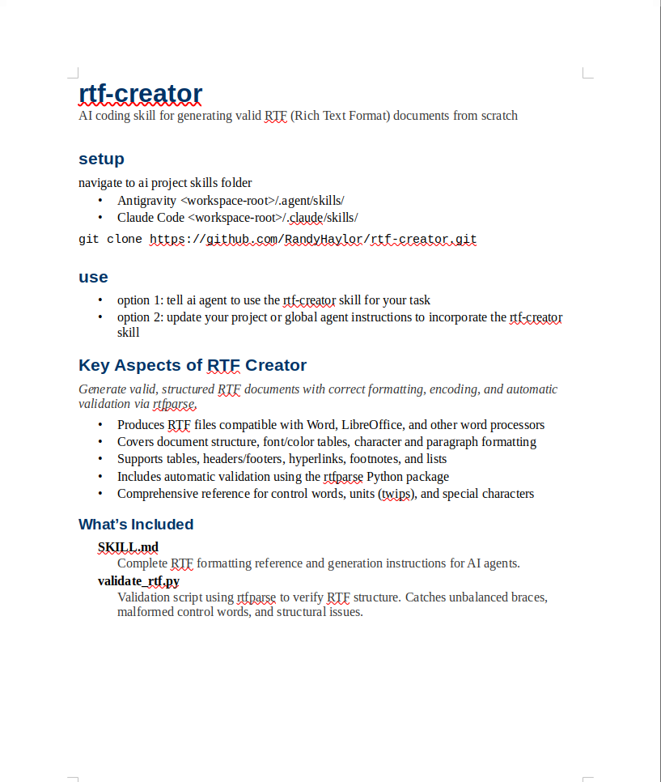

<h1>rtf-creator</h1>

AI coding skill for generating valid RTF (Rich Text Format) documents from scratch

<h2>setup</h2>

navigate to ai project skills folder

<ul>
  <li>Antigravity &lt;workspace-root&gt;/.agent/skills/</li>
  <li>Claude Code &lt;workspace-root&gt;/.claude/skills/</li>
</ul>
<pre><code>git clone https://github.com/RandyHaylor/rtf-creator.git</code></pre>

<h2>use</h2>
<ul>
  <li>option 1: tell ai agent to use the rtf-creator skill for your task</li>
  <li>option 2: update your project or global agent instructions to incorporate the rtf-creator skill</li>
</ul>

<h2>Key Aspects of RTF Creator</h2>

  <em>
    Generate valid, structured RTF documents with correct formatting, encoding,
    and automatic validation via rtfparse.
  </em>

<ul>
  <li>Produces RTF files compatible with Word, LibreOffice, and other word processors</li>
  <li>Covers document structure, font/color tables, character and paragraph formatting</li>
  <li>Supports tables, headers/footers, hyperlinks, footnotes, and lists</li>
  <li>Includes automatic validation using the rtfparse Python package</li>
  <li>Comprehensive reference for control words, units (twips), and special characters</li>
</ul>

<h3>What's Included</h3>

<ul>
  <li>
    <strong>SKILL.md</strong>
    
Complete RTF formatting reference and generation instructions for AI agents.

  </li>
  <li>
    <strong>validate_rtf.py</strong>
    
Validation script using rtfparse to verify RTF structure. Catches unbalanced braces, malformed control words, and structural issues.

  </li>
</ul>
